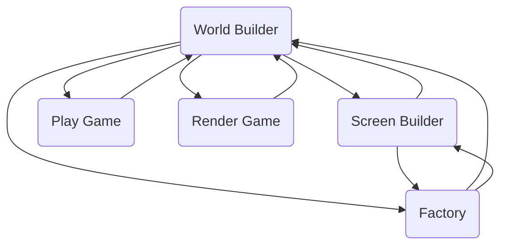

# Editor Mode and Builder Mode

The Nero Game Editor can be used to perform several tasks like create a new game level, create a custom game object, etc. Each of those tasks can only be performed when the Editor is in a specific mode called the Editor Mode. Some Editor Modes have some sub-mode called a Builder Mode.

## Editor Mode and Builder Mode

- WORLD_BUILDER
  - Object
  - Mesh
  - Joint
- SCREEN_BUILDER
  - Object
- FACTORY
  - Object
  - Mesh
  - Joint
- PLAY_GAME
  - None
- RENDER_GAME
  - None
- NONE
  - None

## Default States

Game Editor Started - No Project Opened
- Editor Mode = NONE
- Builder Mode = NONE

Game Editor Started - Project Opened
- Editor Mode = Default Mode = WORLD_BUILDER
- Builder Mode = Default Mode = OBJECT

Game Editor Started - After Closing Project
- Editor Mode = NONE
- Builder Mode = NONE

## Transitions

